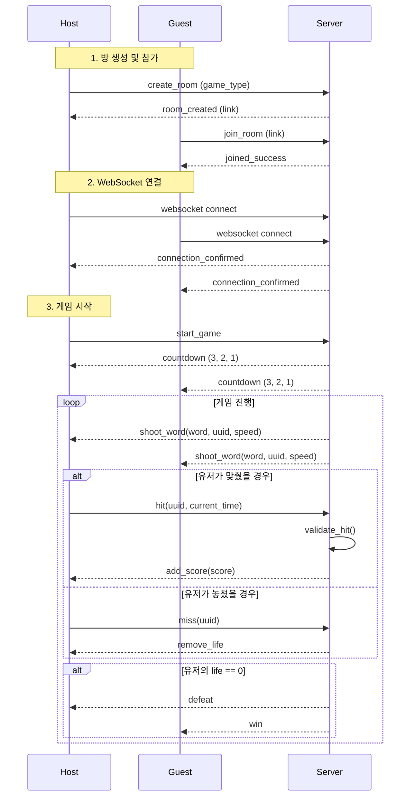

# 🎮 실시간 웹소켓 기반 멀티 게임

## 📌 개요

이 프로젝트는 **실시간 단어 낙하 게임**으로, 호스트와 게스트가 같은 방에서 경쟁하며 단어를 맞추는 게임입니다. 게임은 **WebSocket**을 통해 실시간으로 진행되며, 서버는 단어 발사, 판정, 점수 계산, 생명 관리를 담당합니다.

---

## 🧩 기능 요구사항

- 호스트가 방 생성 및 게임 모드 선택
- 게스트가 링크를 통해 방 참여
- 실시간 WebSocket 연결로 두 유저 간 상호작용
- 서버에서 단어 생성 및 난이도 조절
- 클라이언트의 조작된 요청 검증 기능 내장

---

## 🏗️ 주요 클래스 구조

### `GameWord`

| 필드명 | 타입 | 설명 |
| --- | --- | --- |
| `word` | `str` | 낙하하는 단어 |
| `type` | `str` | 단어 타입 (`normal`, `heal`) |
| `speed` | `int` | 단어 낙하 속도 |
| `score` | `int` | 적중 시 획득 점수 |
| `uuid` | `str` | 단어 식별용 UUID |
| `created_at` | `datetime` | 생성 시간 |

---

### `GameUser`

| 필드명 | 타입 | 설명 |
| --- | --- | --- |
| `user_id` | `str` | 고유 사용자 ID |
| `count` | `int` | 적중한 단어 개수 |
| `score` | `int` | 현재 점수 |
| `life` | `int` | 남은 생명 수 |
| `is_host` | `bool` | 호스트 여부 |

---

### `Room`

| 필드명 | 타입 | 설명 |
| --- | --- | --- |
| `user_host` | `GameUser` | 호스트 사용자 객체 |
| `user_guest` | `GameUser` | 게스트 사용자 객체 |
| `word_list` | `List[GameWord]` | 현재 방에서 발사된 단어 리스트 |
| `game_type` | `str` | 게임 타입 (`kr`, `en`, `complex` 등) |

---

## 🎮 게임 진행 시나리오

1. **호스트가 방 생성**
    - 게임 모드(`game_type`) 선택
2. **참여 링크 생성 및 공유**
3. **게스트가 참여 링크를 통해 입장**
4. **양측 WebSocket 연결 완료**
5. **게임 대기 화면 진입**
6. **호스트가 게임 시작 버튼 클릭**
7. **3, 2, 1 카운트다운**
8. **서버 → 클라이언트: `shoot_word` 이벤트 전송**
    - 포함 정보: `word`, `type`, `speed`, `uuid`
9. **클라이언트: 단어 노트 UI 생성**
10. **클라이언트: 단어 히트 시 `hit` 이벤트 서버 전송**
11. **서버: `uuid`, `speed`, `created_at` 기반으로 유효성 검사**
12. **서버 → 클라이언트: `add_score` 이벤트 전송**
- 점수 및 카운트 반영
1. **단어 바닥 충돌 시 클라이언트 → 서버: `miss` 이벤트 전송**
2. **서버 → 클라이언트: `remove_life` 이벤트 전송**
3. **생명 0일 경우: 승패 판정**
- 각각에게 `win` 또는 `defeat` 이벤트 전송

---

## 📡 주요 WebSocket 이벤트 요약

| 이벤트명 | 방향 | 설명 |
| --- | --- | --- |
| `shoot_word` | 서버 → 클라이언트 | 새로운 단어 발사 |
| `hit` | 클라이언트 → 서버 | 단어 적중 요청 |
| `add_score` | 서버 → 클라이언트 | 점수 및 상태 업데이트 |
| `miss` | 클라이언트 → 서버 | 단어 미스 보고 |
| `remove_life` | 서버 → 클라이언트 | 생명 감소 알림 |
| `win` / `defeat` | 서버 → 클라이언트 | 게임 결과 전달 |

---

## 🔒 보안 및 검증

- **조작된 `hit` 요청 방지**
    - 서버는 `created_at`, `speed`, `uuid`, 현재 시간을 활용하여 클라이언트 판정 유효성 검증